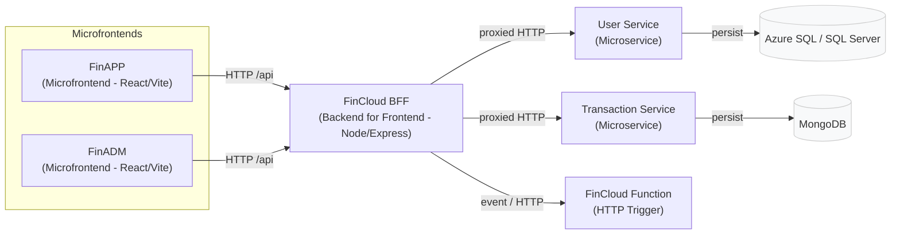
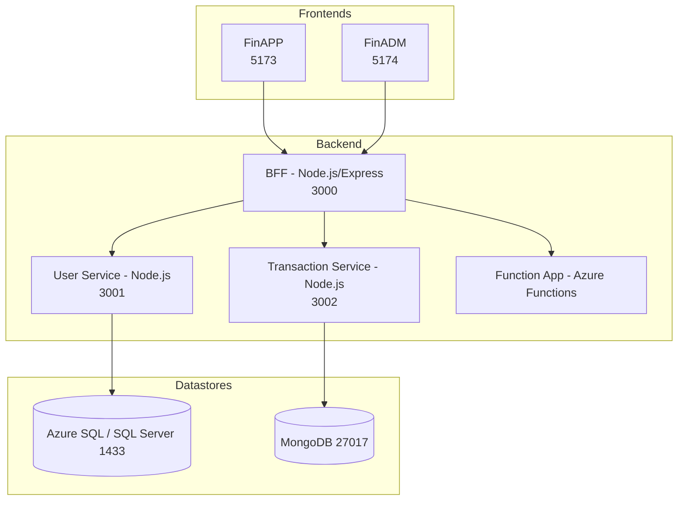

# Diagramas de Arquitetura (Mermaid)

Este arquivo contém diagramas Mermaid simples (C4-like) para ajudar na comunicação arquitetural. Você pode visualizar estes diagramas no GitHub ou em um renderer compatível com Mermaid.

## C4 — System Context

## C4 — Container Diagram (detalhado)

Observações

- Os diagramas são propositalmente simples — servem como mapa rápido.
- Se preferir, posso gerar diagramas C4 mais formais (levels: contexto, container, component) ou exportar PNG/SVG.
